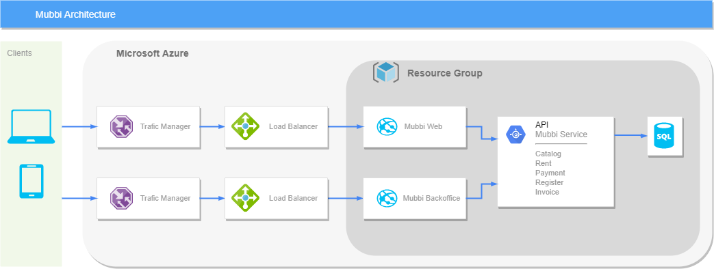

# mubbi-service

# User Secrets

In order to fully test your application, you will have to setup the secrets (sensitive data that are not replicated to the repository).
You can get access to them by talking to any Mubbi core team member.

To setup your secrets do the following:
1. On the project folder, run `dotnet user-secrets init --project .\src\Mubbi.Marketplace.API\`
2. Go to the {PATH} and add the secrets on to the secrets.json file

The {PATH} refers to:
### Windows
`%APPDATA%\Microsoft\UserSecrets\<user_secrets_id>\secrets.json`
### Linux/macOS
`~/.microsoft/usersecrets/<user_secrets_id>/secrets.json`